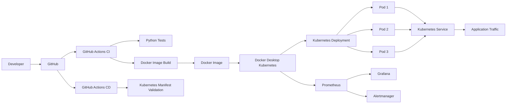

# 🚀 Zero-Downtime Deployment Platform

A production-style DevOps project that demonstrates how to deploy new application versions on Kubernetes while keeping the application available during the deployment process.

The project combines **Docker, Kubernetes, GitHub Actions, automated testing, rolling deployments, health checks, container security, monitoring, rollback, and Infrastructure as Code** into a single deployment workflow.

The primary goal was not simply to deploy an application to Kubernetes, but to design a deployment process that can safely replace application instances while maintaining healthy replicas throughout the update.

---

## 📌 Project Overview

In a traditional deployment, releasing a new application version can require stopping the existing application, deploying the new version, and then starting it again.

That approach can create a period of downtime.

This project demonstrates a different approach using Kubernetes **RollingUpdate deployments**.

Instead of replacing all application instances at once, Kubernetes gradually introduces new pods while keeping existing healthy pods available.

The deployment is configured with:

```yaml
replicas: 3

strategy:
  type: RollingUpdate
  rollingUpdate:
    maxUnavailable: 0
    maxSurge: 1
```

This configuration means:

* Three application replicas normally remain available.
* Kubernetes is not allowed to intentionally reduce the number of available replicas during the update.
* One additional pod can temporarily be created during the rollout.
* New pods must pass their readiness check before being considered ready.
* Once replacement pods become healthy, older pods can be terminated.

This creates the foundation for a zero-downtime deployment strategy.

---

# 🎯 Project Objectives

The project was designed around several practical DevOps objectives:

1. Containerize a production-style application.
2. Run the application using Kubernetes.
3. Implement rolling deployments.
4. Prevent unavailable replicas during deployments.
5. Use health checks to protect traffic from unhealthy pods.
6. Implement rollback capabilities.
7. Automate application testing with CI.
8. Validate Kubernetes manifests automatically.
9. Apply basic container security practices.
10. Configure resource management and autoscaling.
11. Add monitoring and alerting.
12. Structure the project so it can later be extended to AWS/EKS.

---

# 🏗️ Architecture



---

# 🔄 Deployment Flow

The deployment workflow can be summarized as:

```text
Developer
   │
   ▼
GitHub Repository
   │
   ├───────────────┐
   ▼               ▼
CI Pipeline      CD Pipeline
   │               │
   ▼               ▼
Run Tests       Validate Kubernetes YAML
   │
   ▼
Build Docker Image
   │
   ▼
Kubernetes
   │
   ▼
Rolling Deployment
   │
   ├── Existing healthy pods
   │
   ├── New pod created
   │
   ├── Readiness check
   │
   ├── New pod becomes Ready
   │
   └── Old pod removed
```

---

# 🧩 Application

The application is a lightweight **FastAPI** service written in Python.

It exposes several endpoints:

| Endpoint      | Purpose                     |
| ------------- | --------------------------- |
| `/`           | Application information     |
| `/health`     | Kubernetes health check     |
| `/version`    | Current application version |
| `/api/status` | Application runtime status  |

Example health response:

```json
{
  "status": "healthy",
  "version": "3.0.0"
}
```

The `/health` endpoint is particularly important because Kubernetes uses it for both readiness and liveness checks.

---

# 🐳 Docker

The application is packaged as a Docker image.

The Dockerfile uses a lightweight Python base image and installs only the dependencies required by the application.

The container was also hardened so that the application does not run as root.

The final image uses numeric UID:

```text
10001
```

The container additionally uses:

```text
allowPrivilegeEscalation: false
```

and drops all Linux capabilities:

```yaml
capabilities:
  drop:
    - ALL
```

These controls reduce the privileges available to the application if the container is compromised.

The image currently used by Kubernetes is:

```text
zero-downtime-api:4.0.1
```

The `4.0.1` image is a hardened container build. The application itself reports version `3.0.0`.

---

# ☸️ Kubernetes Architecture

The application runs inside the Kubernetes namespace:

```text
zero-downtime
```

The deployment consists of:

### Namespace

Provides logical isolation for the application resources.

### Deployment

Manages the application pods and performs rolling updates.

### Service

Provides stable internal networking to the application pods.

### ConfigMap

Stores non-sensitive application configuration.

### HorizontalPodAutoscaler

Defines the desired CPU-based scaling policy.

### Ingress

Defines HTTP routing for:

```text
zero-downtime.local
```

---

# ♻️ Zero-Downtime Rolling Deployment

The most important component of the project is the Kubernetes rolling deployment strategy.

The deployment uses:

```yaml
strategy:
  type: RollingUpdate
  rollingUpdate:
    maxUnavailable: 0
    maxSurge: 1
```

## What does `maxUnavailable: 0` mean?

Kubernetes should not intentionally make an available replica unavailable during the rolling update.

With three replicas, the deployment attempts to keep the existing healthy capacity available while replacement pods are being started.

## What does `maxSurge: 1` mean?

Kubernetes is allowed to temporarily create one additional pod beyond the desired replica count.

For example:

```text
Before deployment:

Pod 1
Pod 2
Pod 3

During rollout:

Pod 1
Pod 2
Pod 3
Pod 4  ← new version

After Pod 4 becomes Ready:

Pod 2
Pod 3
Pod 4

Old Pod 1 removed
```

The process continues until all old pods have been replaced.

---

# ❤️ Readiness and Liveness Probes

The application exposes:

```text
GET /health
```

Kubernetes uses this endpoint for two different purposes.

## Readiness Probe

The readiness probe determines whether a pod is ready to receive traffic.

A new pod must successfully respond to the health endpoint before Kubernetes considers it ready.

This prevents a newly started but not-yet-ready application from receiving traffic.

## Liveness Probe

The liveness probe determines whether the application is still functioning.

If the container becomes unhealthy, Kubernetes can restart it.

Configuration:

```yaml
readinessProbe:
  httpGet:
    path: /health
    port: 8000

livenessProbe:
  httpGet:
    path: /health
    port: 8000
```

---

# 🔙 Rollback

A deployment strategy is incomplete without a recovery mechanism.

Kubernetes maintains deployment revisions that can be used to return to a previous working version.

The project tested rollback using:

```bash
kubectl rollout history deployment/zero-downtime-api \
  -n zero-downtime
```

and:

```bash
kubectl rollout undo deployment/zero-downtime-api \
  -n zero-downtime
```

This provides a straightforward recovery mechanism when a newly deployed version introduces a problem.

---

# 🔐 Container Security

Security was considered at the container and Kubernetes levels.

The application container:

* Does not run as root.
* Uses UID `10001`.
* Does not require privilege escalation.
* Drops all Linux capabilities.

Kubernetes configuration includes:

```yaml
securityContext:
  allowPrivilegeEscalation: false
  capabilities:
    drop:
      - ALL
```

This follows the principle of running workloads with only the privileges they require.

---

# 📊 Resource Management

The application defines Kubernetes resource requests:

```yaml
requests:
  cpu: "100m"
  memory: "128Mi"
```

and limits:

```yaml
limits:
  cpu: "500m"
  memory: "256Mi"
```

Requests help Kubernetes understand the resources required by the workload.

Limits prevent a container from consuming unlimited CPU or memory.

---

# 📈 Horizontal Pod Autoscaling

The project includes an HPA configuration with:

```text
Minimum replicas: 3
Maximum replicas: 5
CPU target: 70%
```

The configuration is located at:

```text
kubernetes/hpa.yaml
```

The HPA resource itself was successfully created.

The local environment did not provide the CPU metrics required to exercise automatic scaling, so autoscaling was configured but not presented as a successfully demonstrated load test.

---

# 🌐 Kubernetes Service

The application is exposed internally through a Kubernetes `ClusterIP` service.

```text
Service: zero-downtime-api
Port: 8000
```

The Service provides a stable endpoint while Kubernetes manages the individual pod IP addresses behind it.

This is important during rolling deployments because the application pods can be replaced without requiring clients to know the individual pod addresses.

---

# 🌍 Ingress

An NGINX Ingress configuration is included for:

```text
zero-downtime.local
```

The Ingress manifest demonstrates how external HTTP routing could be introduced.

The core deployment validation was performed through the Kubernetes Service on Docker Desktop. An NGINX ingress controller was not required for the main zero-downtime demonstration.

---

# 🔧 CI Pipeline

GitHub Actions is used to automate validation of application changes.

The CI workflow performs:

```text
Checkout
   ↓
Setup Python 3.12
   ↓
Install dependencies
   ↓
Run pytest
   ↓
Build Docker image
```

Workflow:

```text
.github/workflows/ci.yaml
```

The CI pipeline successfully executed during development.

---

# 🚀 CD Pipeline

The CD workflow validates Kubernetes manifests whenever changes are pushed to the main branch.

It performs:

```text
Checkout repository
        ↓
Install PyYAML
        ↓
Read Kubernetes manifests
        ↓
Validate YAML
        ↓
Check required Kubernetes fields
```

Workflow:

```text
.github/workflows/cd.yaml
```

The CD pipeline does not attempt to connect to the developer's local Kubernetes cluster.

This is intentional.

GitHub-hosted runners cannot directly access a Kubernetes API running inside the developer's local Docker Desktop environment.

Instead, the pipeline performs cluster-independent manifest validation.

---

# 📡 Monitoring and Observability

The project uses the Kubernetes `kube-prometheus-stack`.

The monitoring environment includes:

* Prometheus
* Grafana
* Alertmanager
* kube-state-metrics
* Node exporter

Prometheus provides metrics collection.

Grafana provides visualization.

Alertmanager provides alert management.

Grafana was successfully accessed locally through Kubernetes port forwarding.

```bash
kubectl port-forward \
  -n monitoring \
  svc/monitoring-grafana \
  3000:80
```

Grafana:

```text
http://localhost:3000
```

---

# 🏗️ Terraform

Terraform was included as the Infrastructure as Code foundation for future cloud deployment.

The Terraform directory contains:

```text
terraform/
├── main.tf
├── providers.tf
├── variables.tf
└── outputs.tf
```

Terraform was successfully initialized and validated.

At the current stage, these Terraform files do not provision AWS infrastructure.

No `terraform apply` was performed.

The next logical extension would be to use Terraform to provision AWS infrastructure such as:

```text
VPC
 ├── Public Subnets
 ├── Private Subnets
 ├── NAT Gateway
 ├── Security Groups
 └── EKS Cluster
```

This keeps the current project safe to run locally without unintentionally creating AWS resources.

---

# 🧪 Testing and Verification

The project was validated at multiple levels.

### Application

Automated Python tests were created using Pytest.

### Docker

The final container image was built successfully and verified to run using a non-root UID.

### Kubernetes

The application successfully reached:

```text
3/3 Ready
3/3 Available
```

during final validation.

### Deployment

Kubernetes successfully completed rolling deployments.

### Rollback

A rollback from a newer application revision to a previous revision was successfully tested.

### CI

GitHub Actions CI completed successfully.

### CD

GitHub Actions CD completed successfully.

### Monitoring

Prometheus, Grafana and Alertmanager were successfully deployed.

### Terraform

Terraform initialization and validation completed successfully.

---

# 🛠️ Troubleshooting Experience

One useful failure encountered during development involved Kubernetes rejecting the container security configuration.

The initial container used a named Linux user:

```text
appuser
```

Kubernetes reported that it could not verify the user as non-root because the image specified a non-numeric user.

The container was changed to use:

```text
UID 10001
```

The image was rebuilt and redeployed.

The rollout then completed successfully.

This demonstrated an important real-world DevOps lesson:

> Container security configuration must be compatible with the runtime's security validation.

Another issue occurred when GitHub Actions initially attempted to validate Kubernetes resources against a cluster that did not exist on the GitHub runner.

The CD workflow was redesigned to perform cluster-independent Kubernetes manifest validation instead.

---

# 📁 Repository Structure

```text
zero-downtime-deployment/
│
├── .github/
│   └── workflows/
│       ├── ci.yaml
│       └── cd.yaml
│
├── app/
│   ├── src/
│   │   ├── __init__.py
│   │   └── main.py
│   │
│   ├── tests/
│   │   └── test_health.py
│   │
│   ├── Dockerfile
│   ├── pytest.ini
│   └── requirements.txt
│
├── kubernetes/
│   ├── namespace.yaml
│   ├── deployment.yaml
│   ├── service.yaml
│   ├── configmap.yaml
│   ├── hpa.yaml
│   └── ingress.yaml
│
├── terraform/
│   ├── main.tf
│   ├── providers.tf
│   ├── variables.tf
│   └── outputs.tf
│
├── docs/
│   ├── architecture/
│   ├── deployment/
│   └── troubleshooting/
│
├── CHANGELOG.md
├── README.md
└── .gitignore
```

---

# ▶️ Running the Project Locally

## 1. Clone the repository

```bash
git clone https://github.com/DhirajCloud/zero-downtime-deployment.git
cd zero-downtime-deployment
```

## 2. Run application tests

```bash
cd app

python3 -m venv .venv
source .venv/bin/activate

pip install -r requirements.txt
pytest -q
```

## 3. Build the Docker image

From the repository root:

```bash
docker build \
  -t zero-downtime-api:4.0.1 \
  ./app
```

## 4. Deploy to local Kubernetes

```bash
kubectl apply -f kubernetes/namespace.yaml
kubectl apply -f kubernetes/configmap.yaml
kubectl apply -f kubernetes/deployment.yaml
kubectl apply -f kubernetes/service.yaml
kubectl apply -f kubernetes/hpa.yaml
kubectl apply -f kubernetes/ingress.yaml
```

## 5. Verify the deployment

```bash
kubectl get deployment,pods,svc \
  -n zero-downtime
```

## 6. Verify rollout

```bash
kubectl rollout status \
  deployment/zero-downtime-api \
  -n zero-downtime
```

## 7. Access the application

```bash
kubectl port-forward \
  -n zero-downtime \
  svc/zero-downtime-api \
  8000:8000
```

Then open:

```text
http://localhost:8000
http://localhost:8000/health
http://localhost:8000/version
http://localhost:8000/api/status
```

---

# 📋 Project Status

| Component             | Status             |
| --------------------- | ------------------ |
| FastAPI application   | ✅ Completed        |
| Automated tests       | ✅ Completed        |
| Docker container      | ✅ Completed        |
| Non-root container    | ✅ Completed        |
| Kubernetes Deployment | ✅ Completed        |
| Rolling deployment    | ✅ Completed        |
| Health probes         | ✅ Completed        |
| Kubernetes Service    | ✅ Completed        |
| ConfigMap             | ✅ Completed        |
| HPA configuration     | ✅ Configured       |
| Ingress configuration | ✅ Configured       |
| Rollback              | ✅ Tested           |
| Prometheus            | ✅ Running          |
| Grafana               | ✅ Running          |
| Alertmanager          | ✅ Running          |
| GitHub Actions CI     | ✅ Passing          |
| GitHub Actions CD     | ✅ Passing          |
| Terraform validation  | ✅ Passing          |
| AWS/EKS deployment    | ⏳ Future extension |
| ECR integration       | ⏳ Future extension |

---

# 🎓 What This Project Demonstrates

This project demonstrates practical knowledge of:

* Linux/container concepts
* Docker
* Kubernetes
* Kubernetes Deployments
* RollingUpdate strategy
* Readiness and liveness probes
* Kubernetes Services
* ConfigMaps
* HPA
* Ingress
* Container security
* Resource management
* Git
* GitHub
* GitHub Actions
* CI/CD
* Python automation/testing
* Prometheus
* Grafana
* Alertmanager
* Terraform
* Production troubleshooting
* Rollback strategies
* High-availability deployment concepts

---

# 🔮 Future Improvements

The architecture can be extended into a full cloud deployment by adding:

1. Amazon ECR for container image storage.
2. Amazon EKS for managed Kubernetes.
3. Terraform-managed AWS networking.
4. IAM least-privilege roles.
5. GitHub Actions deployment to EKS.
6. Secrets management.
7. Container vulnerability scanning.
8. TLS certificates.
9. External DNS.
10. Blue-green deployments.
11. Canary deployments.
12. Automated rollback based on application health metrics.
13. Production Grafana dashboards.
14. Separate staging and production environments.

---

# 👨‍💻 Author

**Dhiraj Dwivedi**

DevOps / Cloud Engineer

GitHub:
https://github.com/DhirajCloud

---

## ⭐ Project Summary

This project demonstrates a complete local DevOps deployment lifecycle:

```text
Code
 ↓
GitHub
 ↓
CI
 ↓
Tests
 ↓
Docker Build
 ↓
Kubernetes
 ↓
Rolling Deployment
 ↓
Health Checks
 ↓
Service
 ↓
Monitoring
 ↓
Rollback
```

The main engineering objective is to demonstrate how Kubernetes can safely introduce a new application version while maintaining healthy application capacity instead of taking the entire service offline.
